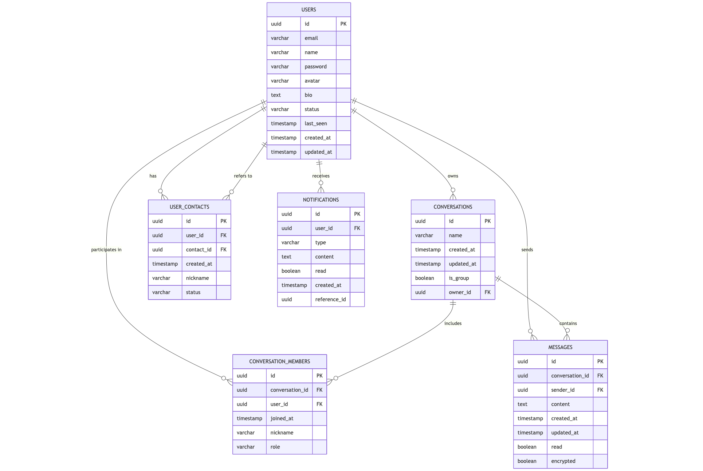

# ClearBox Database Schema

## Schema Description

The database schema shown in the image above illustrates the relational structure of the ClearBox application's data model. The schema consists of six main tables that work together to support the messaging and user management functionality:

### Users Table
- UUID primary key for unique user identification
- Email and name for user identification
- Securely hashed password for authentication
- Avatar URL and bio for profile customization
- Status field to track user availability (online, offline, away)
- Last_seen timestamp to record recent activity
- Created_at and updated_at timestamps for record management

### Conversations Table
- UUID primary key for conversation identification
- Name field for group conversations
- Is_group boolean flag to distinguish between 1-on-1 and group chats
- Owner_id as foreign key referencing the user who created the conversation
- Created_at and updated_at timestamps for record management

### Conversation Members Table
- UUID primary key for membership record
- Conversation_id and user_id foreign keys creating the many-to-many relationship
- Joined_at timestamp recording when the user joined
- Nickname field for custom display names within conversations
- Role field to define user permissions within the conversation (admin, member)

### Messages Table
- UUID primary key for message identification
- Conversation_id and sender_id foreign keys linking messages to conversations and users
- Content field storing the actual message text
- Created_at and updated_at timestamps for message history
- Read boolean flag to track message receipt status
- Encrypted boolean flag indicating if the content is encrypted

### User Contacts Table
- UUID primary key for contact relationship
- User_id and contact_id foreign keys connecting users in a contact relationship
- Created_at timestamp recording when the contact was added
- Nickname field for custom display names for contacts
- Status field tracking relationship state (pending, accepted, blocked)

### Notifications Table
- UUID primary key for notification identification
- User_id foreign key identifying the notification recipient
- Type field categorizing notifications (message, contact_request, etc.)
- Content field with notification details
- Read boolean flag tracking if user has seen the notification
- Created_at timestamp recording when the notification was generated
- Reference_id UUID linking to related entities (message, conversation, etc.)

## Security Considerations

- Passwords are securely hashed before storage
- Message content can be encrypted as indicated by the encrypted flag
- Database connections use TLS/SSL
- Database queries use parameterized statements to prevent SQL injection 

## Relationships

The schema implements several key relationships:
- Users own conversations (one-to-many)
- Users participate in conversations through conversation members (many-to-many)
- Users send messages (one-to-many)
- Users have contacts with other users (many-to-many)
- Users receive notifications (one-to-many)
- Conversations include multiple members (one-to-many)
- Conversations contain multiple messages (one-to-many)
- User contacts refer back to users (many-to-one)