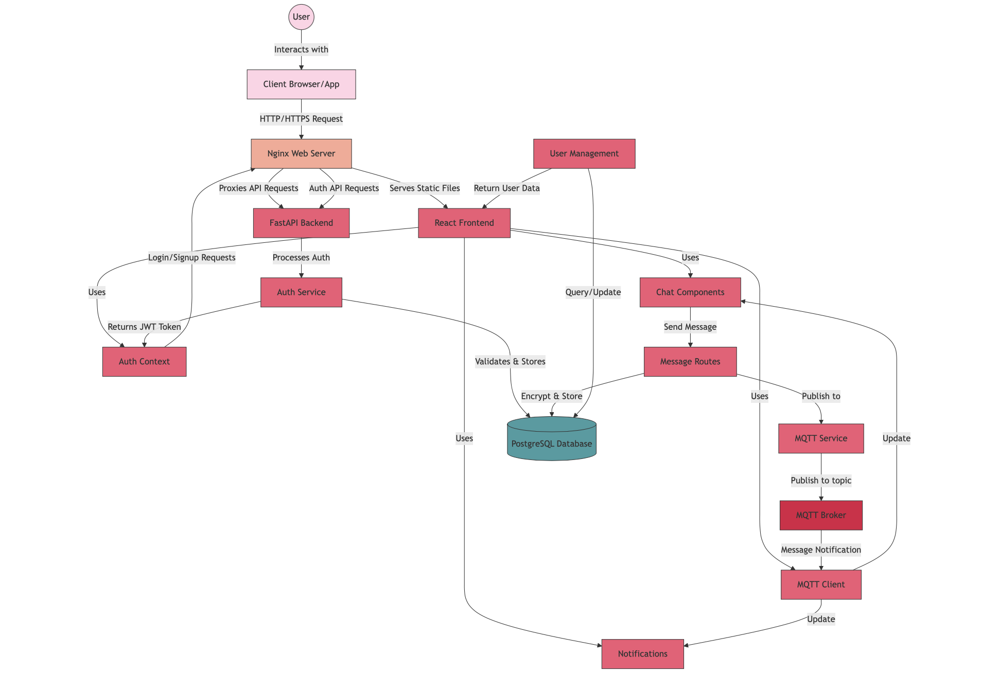

# ClearBox System Architecture

## Key Components Description

1. **Client Layer**: Web browsers and mobile devices that access the ClearBox application.

2. **Presentation Layer**: Nginx server handling HTTPS, static file serving, and API request routing.

3. **Application Layer**:
   - **Frontend**: React application with components for authentication, messaging, notifications
   - **Backend**: FastAPI Python application with routes for auth, messages, and user management

4. **Messaging Layer**: MQTT broker (Mosquitto) handling real-time message delivery, presence updates, and typing indicators.

5. **Data Layer**: PostgreSQL database storing user data, messages, conversations, and attachment metadata.

## Data Flow

1. User requests reach Nginx which serves static files directly or proxies API requests to the backend
2. Authentication requests generate JWT tokens for secure API access
3. Message sending:
   - Messages are encrypted and stored in the database 
   - Real-time notifications sent via MQTT to online recipients
   - Messages are queued for offline recipients
4. When users come online, they fetch new messages and receive real-time updates 

This diagram illustrates the detailed data flow between all components of the ClearBox architecture, showing how user requests are processed through the system layers, how authentication works, and how real-time messaging is handled. 
